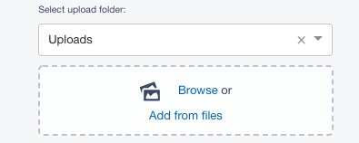

# Select Upload Field

[](https://github.com/silverstripe/silverstripe-selectupload/actions/workflows/ci.yml)
[](https://www.silverstripe.org/software/addons/silverstripe-commercially-supported-module-list/)

## Introduction

This module introduces an extended version of the `UploadField`, called `SelectUploadField`.
This allows users to select the folder that they wish to upload newly added files to,
rather than forcing users to upload to a pre-configured folder.

The folder selection will be remembered for that user, so that if they are uploading files
across multiple pages or data-objects they will only need to change this value if they wish to
change the destination folder.

## Installation

If you have [composer](https://getcomposer.org/) you can install using `composer require silverstripe/selectupload:*`

Otherwise, download the project as a zip archive and extract into the `selectupload` folder.

## Usage

In your project you can use the `SelectUploadField` field as a substitute for `UploadField`.

```php
$field = SelectUploadField::create('MyImage', 'My Image')
	->setFoldername('Parent/Subfolder') // set a good default folder
	->setCanSelectFolder('ADMIN') // So that only important people can select any folder
```

If you wish to replace ALL instances with this field type, you can simply use dependency injection
to specify a custom class

In your mysite/_config/config.yml

```yml
---
Name: mysettings
---
SilverStripe\Core\Injector\Injector:
  SilverStripe\AssetAdmin\Forms\UploadField:
    class: SilverStripe\SelectUpload\SelectUploadField
```

This field appears as below:


