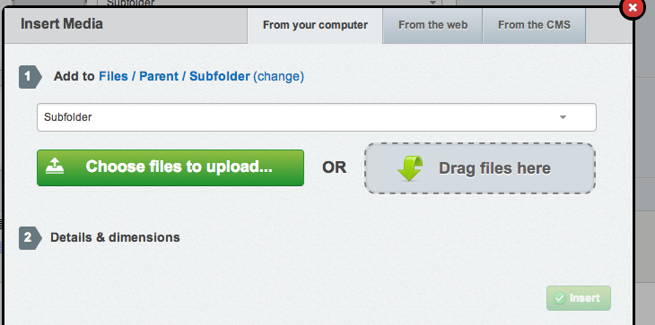

# Select Upload Field

[](https://travis-ci.org/silverstripe-labs/silverstripe-selectupload)

## Introduction

This module introduces an extended version of the `UploadField`, called `SelectUploadField`.
This allows users to select the folder that they wish to upload newly added files to,
rather than forcing users to upload to a pre-configured folder.

This module also by default replaces the existing HtmlEditor media upload form with an 
extended version with the same functionality.

The folder selection will be remembered for that user, so that if they are uploading files
across multiple pages or data-objects they will only need to change this value if they wish to
change the destination folder.

## Installation

If you have [composer](https://getcomposer.org/) you can install using `composer install silverstripe/selectupload:*`

Otherwise, download the project as a zip archive and extract into the `selectupload` folder.

## Usage

In your project you can use the `SelectUploadField` field as a substitute for `UploadField`.

```php
$field = SelectUploadField::create('MyImage', 'My Image')
	->setFoldername('Parent/Subfolder') // set a good default folder
	->setCanSelectFolder('ADMIN') // So that only important people can select any folder
```

This field appears as below:


In the Media popup of HtmlEditorField the folder can also be selected, as below:


